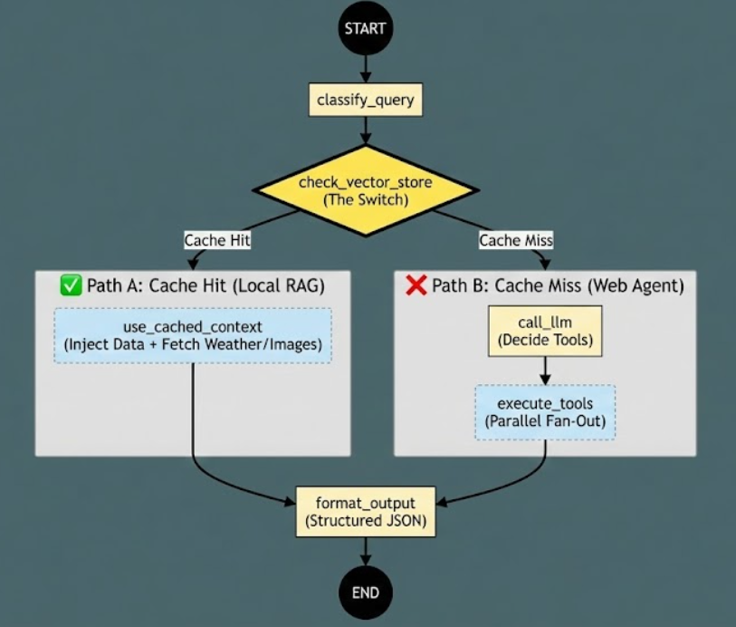

# ✈️ AI Travel Assistant: Multi-Modal Agentic Workflow

**Role:** AI Engineer (Internship) Submission
**Stack:** LangGraph • Streamlit • OpenAI • ChromaDB • Pydantic

## 📖 Overview
This project is an intelligent **Multi-Modal Travel Assistant** that "thinks" before it searches. Unlike a standard chatbot, this agent uses an architectural graph to autonomously decide whether to retrieve highly curated information from a local vector store or perform a live web search for unknown destinations.

It aggregates structured data (text summaries, weather forecasts, and image galleries) and renders them into a rich, interactive Streamlit UI with data visualizations.

---

## 🏗️ Architecture & Graph Topology

The system is built on **LangGraph**, utilizing a state machine architecture to manage context and routing.



### The Workflow
1.  **Classify Query:** An LLM extracts the destination from natural language and sanitizes the input.
2.  **Vector Store Check ("The Switch"):**
    * The agent queries a local **ChromaDB** containing curated facts for *Paris, Tokyo, and New York*.
    * **Intelligent Routing:** It uses a **Cosine Distance Threshold (0.55)** to strictly distinguish between a valid cache hit and a near-match (e.g., rejecting "Mumbai" from matching "Tokyo").
3.  **Path A: Cache Hit (RAG):**
    * Injects pre-loaded context directly into the state.
    * Skips the LLM generation step for the summary.
    * Fetches fresh Weather and Images in parallel.
4.  **Path B: Cache Miss (Web Search):**
    * The LLM autonomously decides which tools to call (`web_search`, `get_weather`, `get_images`).
    * Executes tools in parallel.
5.  **Format Output:** Aggregates all data into a strictly typed Pydantic `StructuredOutput` for the frontend.

---

## ⚡ "Extreme" Distinctions Implemented

This submission implements **all three** advanced challenges outlined in the assignment rubric:

### 🏆 Distinction 1: "Manual" Transmission (No Prebuilt Nodes)
Instead of using LangGraph's prebuilt `ToolNode`, I implemented a custom `node_execute_tools_parallel`.
* **Logic:** It manually iterates through the LLM's `tool_calls` payload.
* **Protocol:** It constructs `ToolMessage` objects manually, demonstrating a deep understanding of the underlying LLM API protocol rather than relying on framework abstractions.

### 🚀 Distinction 2: Parallel "Fan-Out" (Async Concurrency)
The system does not fetch data sequentially.
* **Implementation:** Used `asyncio.gather()` within the tool execution node.
* **Benefit:** The Weather API, Image API, and Web Search run simultaneously, significantly reducing user wait time (simulated by non-blocking sleeps in the mock APIs).

### 🧠 Distinction 3: Human-in-the-Loop (Memory)
The graph utilizes a **Checkpointer** (`MemorySaver`) to preserve conversational context.
* **Feature:** Each session is assigned a unique `thread_id`.
* **Behavior:** The agent retains memory of the current city across interactions, allowing for follow-up questions without losing state.

---

## 🛠️ Tech Stack & Modules

* **Orchestration:** `langgraph`, `langchain`
* **Frontend:** `streamlit`, `plotly` (for interactive line charts)
* **Database:** `chromadb` (Local Vector Store) with `onnxruntime` embeddings.
* **Validation:** `pydantic` (for Structured Output parsing).
* **APIs:**
    * **LLM:** OpenAI `gpt-4o-mini`
    * **Tools:** Custom Mock APIs (Weather/Image) + Tavily/DuckDuckGo simulation.

## 🚀 Setup & Installation

1.  **Clone the repository:**
    ```bash
    git clone <your-repo-url>
    cd travel-assistant
    ```

2.  **Install Dependencies:**
    ```bash
    pip install -r requirements.txt
    ```

3.  **Environment Setup:**
    Create a `.env` file in the root directory:
    ```bash
    OPENAI_API_KEY="sk-..."
    ```

4.  **Run the Application:**
    ```bash
    streamlit run src/ui/app.py
    ```

## 🧪 Usage Examples

1.  **Test the "Switch" (Vector Store):**
    * *Input:* "Tell me about Paris"
    * *Result:* **CACHE HIT**. Fast response using pre-loaded data.

2.  **Test the "Search" (Web Path):**
    * *Input:* "Tell me about Mexico"
    * *Result:* **CACHE MISS**. The agent identifies "Mexico" is not in the DB, routes to the LLM, and performs a search.

3.  **Test Memory:**
    * *Input:* "Tokyo" -> *Result:* Shows Tokyo data.
    * *Follow-up:* "What is the weather?" -> *Result:* Remembers context is Tokyo.

## 📂 Project Structure

```text
travel-assistant/
├── src/
│   ├── graph/
│   │   ├── nodes.py          # Core logic (Classify, Check DB, Execute Tools)
│   │   ├── state.py          # Pydantic State definitions
│   │   ├── tools.py          # Mock API definitions (Wikimedia/Weather)
│   │   └── graph_builder.py  # Graph topology & routing logic
│   ├── vector_store/
│   │   └── setup.py          # ChromaDB initialization & distance logic
│   └── ui/
│   |    └── app.py            # Streamlit Frontend
|   └── mock_apis/
|        ├── weather_api.py
|        ├── image_api.py
|        └── search_api.py  
├── graph.png                 # Architecture visualization
├── requirements.txt          # Project dependencies
└── README.md                 # Documentation
```

## Demo


